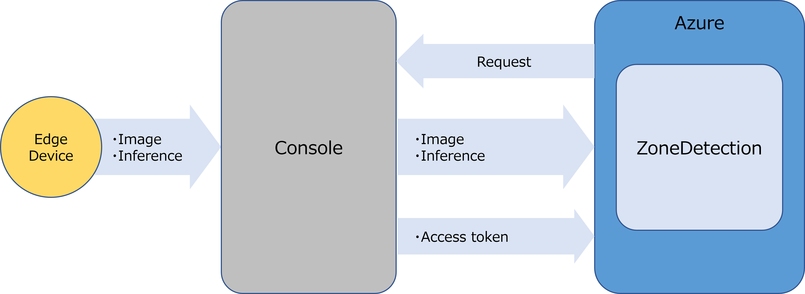

# "**ZoneDetection**" Tutorial <!-- omit in toc -->

## Content <!-- omit in toc -->

- [Overview](#overview)
  - ["**ZoneDetection**" configurations](#zonedetection-configurations)
- [Prerequisite](#prerequisite)
- ["**ZoneDetection**" screen](#zonedetection-screen)
- [Use "**ZoneDetection**"](#use-zonedetection)
  - [1. Display Setup screen](#1-display-setup-screen)
  - [2. Get imaging area](#2-get-imaging-area)
  - [3. Set area for zone detection](#3-set-area-for-zone-detection)
  - [4. Set parameters for detection](#4-set-parameters-for-detection)
  - [5. Save set parameter information](#5-save-set-parameter-information)
  - [6. Monitor zone detection results](#6-monitor-zone-detection-results)
  - [Option. Get token information](#option-get-token-information)
- [Restrictions](#restrictions)

## Overview

"**ZoneDetection**" is a sample zone detection system using AI object detection. 
It provides the following functions on the UI of this application:

- Specifies detection zone 
- Specifies thresholds for object detection and zone detection 
- Monitors detection status and captured images

### "**ZoneDetection**" configurations

Deployed on Azure, "**ZoneDetection**" uses API of "**Console for AITRIOS**", hereafter referred to as "**Console**", to control edge AI device. 

Images and inference results gotten by edge AI device are uploaded to the "**Console**" and then notified to "**ZoneDetection**". 

## Prerequisite

"**ZoneDetection**" application must already be deployed on the tenant. 

See [here](../deploy/README.md) for deploying applications.

## "**ZoneDetection**" screen

This application consists of three screens: 
You can switch between screens by selecting the tabs at the top left of the screen.

| Screen | Usage | 
| ---- | ---- | 
| Setup screen | Adjust and set the parameters needed for the run. | 
| Telemetry/Events screen | Monitor zone detection status and captured images. | 
| Option screen | Get the token information needed to connect to the "**Console**". |

## Use "**ZoneDetection**"

### 1. Display Setup screen

- Select the [**Setup**] tab at the top left of the screen to display the Setup screen

  In the Setup screen, makes the necessary settings for each folding section in the following.
  | Folding section | Usage |
  | ---- | ---- |
  | [**Step 1 : Capture Image**] | Connect to a edge AI device enrolled in the "**Console**" and get images of the imaging area. |
  | [**Step 2 : Specify Zone**] | Set an area for zone detection for the imaging area. |
  | [**Step 3 : Test Detection**] | Set a threshold for each parameter used in detection.   You can test and adjust the settings. |
  | [**Option : Save Parameters**] | Save the parameter information you set in a browser cookie. |

### 2. Get imaging area

- Select the [**Step 1 : Capture Image**] in the folding section 
- Select the Device ID of the edge AI device you want to use from the [**Device ID**] drop-down list
- Select the Model ID you deployed to your edge AI device from the [**Model ID**] drop-down list 
- Press the [**Capture**] button to capture image information

  The function of each display part is as follows:
  | Display part | Function |
  | ---- | ---- |
  | [**Device ID**] | Selects a Device ID of the edge AI device enrolled in the "**Console**". |
  | [**Model ID**] | Selects a Model ID of the Device ID registered in the "**Console**". |
  | [**Capture**] button | Gets image information associated with the selected Device ID/Model ID. |

### 3. Set area for zone detection

- Select the [**Step 2 : Specify Zone**] in the folding section
- Set an area for zone detection by dragging the mouse over the imaging area

  An area for zone detection is displayed with a red frame, and the coordinates of [**Top Left**] and [**Bottom Right**] are updated.

  The function of each display part is as follows:
  | Display part | Function |
  | ---- | ---- |
  | [**Top Left**] | The coordinate of the top left corner of the area for zone detection (outlined in red) is displayed. |
  | [**Bottom Right**] | The coordinate of the bottom right corner of the area for zone detection (outlined in red) is displayed. |

### 4. Set parameters for detection

- Select the [**Step 3 : Test Detection**] in the folding section 
- Set a accuracy of object detection to [**Detection Threshold (percent)**] 
- Set a zone detection overlap rate (IoU) to the [**IoU Threshold (percent)**]
- Set a imaging and detection interval to [**Frequency (seconds)**] 
- Press the [**Start**] button to test run the settings
  
  The bounding box and detection accuracy of the detected objects are drawn on the imaging area on the right side of the screen. 
  - Bottom left of bounding box: Detection accuracy is displayed in yellow. 
  - Top left of bounding box: Overlap rate (IoU) is displayed in green. 

- Press the [**Stop**] button to stop a test run

  The function of each display part is as follows:
  | Display part | Function |
  | ---- | ---- |
  | [**Detection Threshold (percent)**] | Sets a threshold for object detection accuracy. ex.) If the detection accuracy is set to 80%, anything with a detection accuracy of 80% or higher will be detected as an object. | 
  | [**IoU Threshold (percent)**] | Sets the overlap rate (IoU) for determining zone detection. ex.) If the overlap rate (IoU) is set to 20%, an zone detection is determined if the overlap rate between the detected object and the area for zone detection is 20% or more. | 
  | [**Frequency (seconds)**] | Sets a refresh interval for detection results. |
  | [**Start**] button | Starts updating image/detection results. |
  | [**Stop**] button | Stops updating image/detection results. |

### 5. Save set parameter information

- Select the [**Option : Save Parameters**] in the folding section 
- Press the [**Save**] button to save your settings in a cookie

  Saved settings are retained for three days.

  The function of each display part is as follows:
  | Display part  | Function  |
  | ---- | ---- |
  | [**Save**] button | Saves settings in a cookie. Saved settings are retained for three days. |

### 6. Monitor zone detection results

> **Note**  
> Check before using Telemetry/Events screen. 
> Command parameter file connected to the edge AI device is overwritten when inference is started.

- Select the [**Telemetry/Events**] tab at the bottom left of the screen to display the Telemetry/Events screen
  
  The parameters displayed on the screen are the ones saved in the Setup screen, 
  but they can also be changed on this screen.

- Set a detection stay threshold that issues a notification to the [**Notification Period**]
- Set how detection results are displayed to the [**Display Result**]
- Press the [**Start Inference**] button or [**Start Inference (No Image)**] button to start zone detection

  > **Note**  
  > [**Start Inference (No Image)**] lets you to display notifications of detection results with a higher response

- Press the [**Stop Inference**] button to stop zone detection

  The function of each display part is as follows:
  | Display part  | Function  |
  | ---- | ---- |
  | [**Device ID**] | Selects a Device ID of the edge AI device enrolled in the "**Console**". |
  | [**Model ID**] | Selects a Model ID of the Device ID registered in the "**Console**". |
  | [**Detection Threshold**] | Sets a threshold for object detection accuracy.  ex.) If the detection accuracy is set to 80%, anything with a detection accuracy of 80% or higher will be detected as an object. | 
  | [**IoU Threshold**] | Sets the overlap rate (IoU) for determining zone detection.  ex.) If the overlap rate (IoU) is set to 20%, an zone detection is determined if the overlap rate between the detected object and the area for zone detection is 20% or more. | 
  | [**Frequency**] | Sets a refresh interval for detection results. |
  | [**Notification Period**] | Sets a detection stay threshold that issues a notification. ex.) If the detection stay threshold is set to 30 sec, the graph will turn red if an object is detected for more than 30 seconds continuously in the zone detection area.|
  | [**Display Result**] | Selects what to display in the following. **`All`** : Display all detected objects.  **`In Zone`** : Display only zone-detected objects |
  | [**Start Inference**] button | Starts getting inference results (with images) and visualization. |
  | [**Start Inference (No Image)**] button | Starts getting inference results (no image) and visualization. |
  | [**Stop Inference**] button | Stops visualizing inference results. |

### Option. Get token information

You can get token information for connecting to the "**Console REST API**". 
It is used when calling the "**Console REST API**" directly with the curl command, etc.

- Select the [**Option**] tab at the top left of the screen to display the Option screen
- Press the [**Get Token**] button 
- Copy and use text data output to [**Token**]

  The parameters and operating procedure of the Option screen are as follows:
  | Parameter | Meaning |
  | ---- | ---- |
  | [**Token**] | Token information for connecting to the "**Console REST API**" is displayed in the text area. |
  | [**Copy Token**] button | Copy the contents of the [**Token**] text area. |
  | [**Paste Token**] button | Paste what you are copying into the [**Token**] text area. |
  | [**Get Token**] button | Get an access token to connect to the "**Console REST API**". |

## Restrictions

- None
