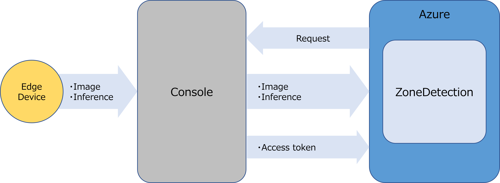

# 「**ZoneDetection**」 チュートリアル <!-- omit in toc -->

## コンテンツ <!-- omit in toc -->

- [概要](#概要)
  - [「**ZoneDetection**」の構成](#zonedetectionの構成)
- [前提条件](#前提条件)
- [「**ZoneDetection**」画面構成](#zonedetection画面構成)
- [「**ZoneDetection**」の使用方法](#zonedetectionの使用方法)
  - [1. Setup画面を表示する](#1-setup画面を表示する)
  - [2. 撮影エリアを取得する](#2-撮影エリアを取得する)
  - [3. 侵入検知を行うエリアを設定する](#3-侵入検知を行うエリアを設定する)
  - [4. 検出で使用するパラメータを設定する](#4-検出で使用するパラメータを設定する)
  - [5. 設定したパラメータ情報を保存する](#5-設定したパラメータ情報を保存する)
  - [6. 侵入検知結果をモニタリングする](#6-侵入検知結果をモニタリングする)
  - [Option. トークン情報を取得する](#option-トークン情報を取得する)
- [制限事項](#制限事項)

## 概要

「**ZoneDetection**」は、AIによる物体検出を利用した侵入検知システムのサンプルです。  
このアプリケーションのUI上で下記の機能を提供します。

- 検知ゾーンの指定
- 物体検出および、侵入検知を判定する閾値の指定
- 検知状況および、撮影画像のモニタリング

### 「**ZoneDetection**」の構成

Azureにデプロイされた「**ZoneDetection**」は、「**Console for AITRIOS**」(以下、「**Console**」)のAPIを利用してエッジAIデバイスの制御を行います。

エッジAIデバイスが撮影した画像と推論結果は、「**Console**」にアップロードされた後、「**ZoneDetection**」に通知されます。

## 前提条件

「**ZoneDetection**」のアプリケーションが、テナント上にデプロイ済みであること。

アプリケーションのデプロイについては、[こちら](../deploy/README_ja.md)を参照してください。

## 「**ZoneDetection**」画面構成

このアプリケーションは、下記の3つの画面で構成されます。  
各画面は、画面左上のタブを選択することで切り替え可能です。

| 画面 | 使用用途 |
| ---- | ---- |
| Setup画面 | 実行に必要なパラメータの調整と設定を行います。 |
| Telemetry/Events画面 | 侵入検知状況および、撮影画像のモニタリングを行います。 |
| Option画面 | 「**Console**」の接続に必要なトークン情報を取得します。 |

## 「**ZoneDetection**」の使用方法

### 1. Setup画面を表示する

- 画面左上の[**Setup**]タブを選択し、Setup画面を表示する

  Setup画面では、下記の折りたたみセクションごとに必要な設定を行います。
  | 折りたたみセクション | 使用用途 |
  | ---- | ---- |
  | [**Step 1 : Capture Image**] | 「**Console**」に登録されているエッジAIデバイスに接続し、撮影エリアの画像を取得します。 |
  | [**Step 2 : Specify Zone**] | 撮影エリアに対して、侵入検知を行うエリアを設定します。 |
  | [**Step 3 : Test Detection**] | 検出で使用する各パラメータの閾値を設定します。 設定値をテストしながら調整することができます。 |
  | [**Option : Save Parameters**] | 設定したパラメータ情報をブラウザのCookieに保存します。 |

### 2. 撮影エリアを取得する

- 折りたたみセクションの[**Step 1 : Capture Image**]を選択する
- [**Device ID**]のプルダウンから、利用するエッジAIデバイスのDevice IDを選択する
- [**Model ID**]のプルダウンから、エッジAIデバイスにデプロイしたModel IDを選択する
- [**Capture**]ボタンを押下して画像情報を取得する

  各表示パーツの機能は下記のとおりです。
  | 表示パーツ | 機能説明 |
  | ---- | ---- |
  | [**Device ID**] | 「**Console**」に登録されているデバイスのDevice IDを選択できます。 |
  | [**Model ID**] | 「**Console**」に登録されているDevice IDのModel IDを選択できます。 |
  | [**Capture**]ボタン | 選択されたDevice ID・Model IDに紐づく画像情報を取得します。 |

### 3. 侵入検知を行うエリアを設定する

- 折りたたみセクションの[**Step 2 : Specify Zone**]を選択する
- 撮影エリア上でマウスをドラッグして、侵入検知を行うエリアを設定する

  侵入検知を行うエリアが赤枠で表示され、[**Top Left**]と[**Bottom Right**]の座標が更新されます。

  各表示パーツの機能は下記のとおりです。
  | 表示パーツ | 機能説明 |
  | ---- | ---- |
  | [**Top Left**] | 侵入検知を行うエリア(赤枠)の左上の角の座標が表示されます。 |
  | [**Bottom Right**] | 侵入検知を行うエリア(赤枠)の右下の角の座標が表示されます。 |

### 4. 検出で使用するパラメータを設定する

- 折りたたみセクションの[**Step 3 : Test Detection**]を選択する
- [**Detection Threshold (percent)**]に物体検出の確度を設定する
- [**IoU Threshold (percent)**]に侵入検知の重複率(IoU)を設定する
- [**Frequency (seconds)**]に撮影と検出頻度の間隔を設定する
- [**Start**]ボタンで設定内容をテスト実行する
  
  画面右側の撮影エリア上に、検出された物体の境界ボックスと検出値が描画されます。
  - 境界ボックスの左下: 検出確度が黄色で表示されます
  - 境界ボックスの左上: 重複率(IoU)が緑色で表示されます

- [**Stop**]ボタンでテスト実行を停止する

  各表示パーツの機能は下記のとおりです。
  | 表示パーツ | 機能説明 |
  | ---- | ---- |
  | [**Detection Threshold (percent)**] | 物体検出確度の閾値を設定できます。 ex.) 検出確度を80％に設定した場合、検出確度が80%以上のものを物体として検出します。 |
  | [**IoU Threshold (percent)**] | 侵入検知を判断する際の重複率(IoU)を設定できます。 ex.) 重複率(IoU)を20％に設定した場合、検出された物体と侵入検知を行うエリアの重複率が20％以上の場合に侵入と判断します。 |
  | [**Frequency (seconds)**] | 検出結果の更新間隔を設定できます。 |
  | [**Start**]ボタン | 画像/検出結果の更新を開始します。 |
  | [**Stop**]ボタン | 画像/検出結果の更新を停止します。 |

### 5. 設定したパラメータ情報を保存する

- 折りたたみセクションの[**Option : Save Parameters**]を選択する
- [**Save**]ボタンを押下し、設定情報をCookieに保存する

  保存した設定情報は3日間保存されます。

  各表示パーツの機能は下記のとおりです。
  | 表示パーツ  | 機能説明  |
  | ---- | ---- |
  | [**Save**]ボタン | 設定情報をCookieに保存する。保存した設定情報は3日間保存されます。 |

### 6. 侵入検知結果をモニタリングする

> **Note**  
> Telemetry/Events画面をご利用の前にご確認ください。  
> 推論開始する際にエッジAIデバイスに接続されているCommand parameter fileが上書きされます。

- 画面左上の[**Telemetry/Events**]タブを選択し、Telemetry/Events画面を表示する
  
  画面上に表示されるパラメータは、Setup画面で保存したものが設定されていますが、
  この画面上でも変更することが可能です。

- [**Notification Period**]に通知を発行する際の検出対象の滞在時間の閾値を設定する
- [**Display Result**]に検知結果の表示方法を設定する
- [**Start Inference**]ボタンまたは、[**Start Inference (No Image)**]ボタンを押下して侵入検知を開始する

  > **Note**  
  > [**Start Inference (No Image)**]を利用すると、より高いレスポンスで検出結果の通知を表示できます。

- [**Stop Inference**]ボタンを押下して侵入検知を停止する

  各表示パーツの機能は下記のとおりです。
  | 表示パーツ  | 機能説明  |
  | ---- | ---- |
  | [**Device ID**] | 「**Console**」に登録されているデバイスのDevice IDを選択できます。 |
  | [**Model ID**] | 「**Console**」に登録されているデバイスのModel IDを選択できます。 |
  | [**Detection Threshold**] | 物体検出確度の閾値を設定できます。 ex.) 検出確度を80％に設定した場合、検出確度が80%以上のものを物体として検出します。 |
  | [**IoU Threshold**] | 侵入検知を判断する際の重複率(IoU)を設定できます。 ex.) 重複率(IoU)を20％に設定した場合、検出された物体と侵入検知を行うエリアの重複率が20％以上の場合に侵入と判断します。 |
  | [**Frequency (seconds)**] | 検出結果の更新間隔を設定できます。 |
  | [**Notification Period**] | 通知を発行する際の検出対象の滞在時間の閾値を設定できます。 ex.) 滞在時間の閾値を30secに設定した場合、侵入検知を行うエリア内で、30秒以上継続して物体が検知された場合にグラフが赤くなります。|
  | [**Display Result**] | 抽出対象の範囲を下記から選択できます。 **`All`** : 検出した物体を全て描画する。 **`In Zone`** : 侵入検知した物体のみ描画する。 |
  | [**Start Inference**]ボタン | 推論結果(画像あり)を取得し可視化を開始できます。 |
  | [**Start Inference (No Image)**]ボタン | 推論結果(画像なし)を取得し可視化を開始できます。 |
  | [**Stop Inference**]ボタン | 推論結果の可視化を停止できます。 |

### Option. トークン情報を取得する

「**Console REST API**」へ接続する際のトークン情報を取得できます。  
「**Console REST API**」をcurlコマンドなどで直接呼び出す場合などに利用します。

- 画面左上の[**Option**]タブを選択し、Option画面を表示する
- [**Get Token**]ボタンを押下する
- [**Token**]に出力されたテキストデータをコピーして利用する

  Option画面のパラメータと操作手順は下記になります。
  | パラメータ名 | 意味 |
  | ---- | ---- |
  | [**Token**] |「**Console REST API**」に接続するためのToken情報がテキストエリアに表示されます。 |
  | [**Copy Token**]ボタン | [**Token**]のテキストエリアの内容をコピーします。 |
  | [**Paste Token**]ボタン | [**Token**]のテキストエリアにコピーしている内容を貼り付けます。 |
  | [**Get Token**]ボタン |「**Console REST API**」に接続するためのAccess Tokenを取得します。 |

## 制限事項

- なし
