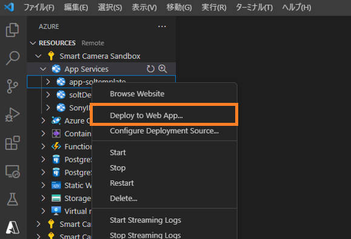
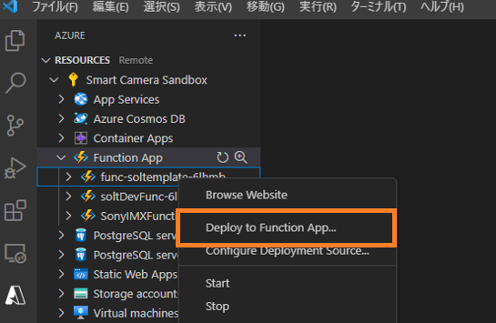

# ZoneDetection Deployment Procedure

## Content

- [Overview](#overview)
- [Prerequisite](#prerequisite)
- [Advance preparation](#advance-preparation)
  - [1. Install required softwares](#1-install-required-softwares)
  - [2. Install VS Code extensions](#2-install-vs-code-extensions)
  - [3. Clone repository](#3-clone-repository)
- [How to build an environment](#how-to-build-an-environment)
  - [1. Register application](#1-register-application)
  - [2. Custom deployment using template](#2-custom-deployment-using-template)
  - [3. Add authentication for WebApp](#3-add-authentication-for-webapp)
- [How to deploy](#how-to-deploy)
  - [1. Deploy WebApp](#1-deploy-webapp)
  - [2. Deploy Functions](#2-deploy-functions)
- [Set up external forwarding in the Console](#set-up-external-forwarding-in-the-console)
  - [1. Get token information](#1-get-token-information)
  - [2. Get Event Hubs information](#2-get-event-hubs-information)
  - [3. Run UpdateIRHubConnector API](#3-run-updateirhubconnector-api)
  - [4. Get storage account information](#4-get-storage-account-information)
  - [5. Run UpdateStorageConnector API](#5-run-updatestorageconnector-api)
- [Restrictions](#restrictions)

## Overview

This procedure provides how to build an environment and how to deploy resources.

## Prerequisite

To proceed with this deployment procedure, you will need the following services and information:. Check in advance.

- Create an Azure account and resource group</br> 
  Get the information that will be used during deployment from the Azure Portal. Here is the information you need:
  - Subscription Name
  - Resource group name
- Connection information to access the Console </br> 
  Get the information that will be used during deployment from the Console. Here is the information you need:
  - Client ID
  - Secret
- Create a Git account and access to "SonySemiconductorSolutions"

## Advance preparation

### 1. Install required softwares

Install the following software on your PC.

- Install Visual Studio Code (Hereafter referred to as VS Code) </br>
  Get the installer for your environment from the [official site](https://azure.microsoft.com/ja-jp/products/visual-studio-code/).

- Install .NET6.0 </br>
  Get the installer for your environment from the [official site](https://dotnet.microsoft.com/en-us/download/dotnet/6.0).

### 2. Install VS Code extensions

Launch VS Code on your PC and install the following extensions.

- Azure tools
- Azure cli
- C#
- C# extensions
- Auto-using for c#
- Nuget package manager

  See the [Visual Studio Code Docs](https://code.visualstudio.com/docs/editor/extension-marketplace#_install-an-extension) to install VS Code extensions. 

### 3. Clone repository

Clone the two repositories containing this repository in any directory. </br>
If you use the git command, you can clone the repository by executing the following command:

- Clone the WebApp repository

  ```bash
  git clone https://github.com/SonySemiconductorSolutions/aitrios-sdk-zone-detection-webapp-cs.git
  ```

- Clone the Functions repository

  ```bash
  git clone https://github.com/SonySemiconductorSolutions/aitrios-sdk-zone-detection-functions-cs.git  
  ```

See the [GitHub Docs](https://docs.github.com/ja/repositories/creating-and-managing-repositories/cloning-a-repository) for other clone methods.

## How to build an environment

### 1. Register application

Get the application (client) ID and directory (tenant) ID to use during deployment.

> **Note** 
> If you do not want to set up Azure Active Directory authentication, hereafter referred to as AAD authentication, the following procedures are not required.</br> 
> Go to the "[2. Custom deployment using template](#2-custom-deployment-using-template)".

- Go to the [Azure Portal Home](https://portal.azure.com/#home)
- Select the [**App registrations**] from the [**Azure services**]
- Select the [**New registration**] from the preceding tab
- Input the "Name" and "Supported account types" on the register an application screen</br> 
  The value you set for this "Name" will be the application ID.
  
- Press the [**Register**] button</br> 
  A summary page for the registered app appears. Make a note of the following values on the screen:
  - Application (client) ID
  - Directory (tenant) ID

### 2. Custom deployment using template

- Go to the [Azure Portal Home](https://portal.azure.com/#home) 
- Select the [**Resource groups**] from the [**Azure services**] 
- Select the name of the resource group you want to use from the list in the resource groups screen 
- Select the [**Export template**] from the left sidebar of the selected resource groups screen
- Select the [**Deploy**] from the top tab to navigate to the custom deployment screen 
- Select the [**Edit template**] to navigate to the edit template screen
- Select the [**Load file**] from the top tab to launch a dialog to open 
- Select the template file, **`./deploy/azuredeploy.json`**, from the cloned WebApp repository 
- Press the [**Save**] button to return to the custom deployment screen 
- On the custom deployment screen, input each item

  Input each item using the following table as a reference. 
  | Input item | Description | Example input |
  | ---- | ---- | ---- |
  | [**Subscription**] | Select your subscription.| Subscription name |
  | [**Resource group**] | Select your resource group. | Resource group name |
  | [**Region**] | Set the region for the deployment environment. | (Asia Pacific) Japan East |
  | [**Unique Id**] | Set the ID to be unique. | Use default value |
  | [**Location**] | Set resource location. | [resorceGrorp().location] |
  | [**Web_app_name**] | Set the name of the WebApp deployment destination.</br>※Use this setting in the "[1. Deploy WebApp](#1-deploy-webapp)". | Any value |
  | [**Function_app_name**] | Set the name of the Functions deployment destination. | Any value |
  | [**Signalr_name**] | Set the name of the SignalR. | Any value |
  | [**Eventhub_name**] | Set the name of the Eventhub. | Any value |
  | [**Storage_account_name**] | Set the name of the storage account. | Any value |
  | [**Storage_account_type**] | Set the storage account type. | Standard_LRS |
  | [**Blob_container_name**] | Set the name of the Blob Container. | Any value |
  | [**Aitios_url**] | Set the Console URL. | "https://console.aitrios.sony-semicon.com/api/v1" |
  | [**Token_url**] | Set the URL to get the Console token. | "https://auth.aitrios.sony-semicon.com/oauth2/default/v1/token" |
  | [**Aitrios_client_id**] | Set the client ID for AITRIOS. | Client ID |
  | [**Aitrios_client_secret**] | Set the secret for AITRIOS. | Secret |
  | [**Aad_tenand_id**] | Set for AAD authentication. | Directory (tenant) ID |
  | [**Aad_client_id**] | Set for AAD authentication. | Application (client) ID |
  | [**Git_webapp_repo**] | Set repository information for WebApp. </br>When creating a resource, remove the default value and leave it empty. | Empty |
  | [**Git_webapp_branch**] | Set repository information for WebApp. </br>When creating a resource, remove the default value and leave it empty. | Empty |
  | [**Git_functionsapp_repo**] | Set repository information for Functions. </br>When creating a resource, remove the default value and leave it empty. | Empty |
  | [**Git_functionsapp_branch**] | Set repository information for Functions. </br>When creating a resource, remove the default value and leave it empty. | Empty |

- Press the [**Review + create**] button

  > **Note**
  > The terms and conditions appear. Read it carefully before proceeding to the next procedure.

- Press the [**Create**] button to start deployment

  > **Note**
  > The deployment process takes some time.</br>
  > When the deployment is complete, you'll see the words "Your deployment is complete" on the screen.

### 3. Add authentication for WebApp

Add authentication for the deployed App Service to the app registration created in the "[1. Register application](#1-register-application)".

> **Note** 
> If you do not want to set up AAD authentication, following procedures are not required.</br> 
> Go to the [How to deploy](#how-to-deploy)

- Go to the [Azure Portal Home](https://portal.azure.com/#home)
- Select the [**App Services**] from the [**Azure services**]
- Select the [**Web_app_name**] created in the "[2. Custom deployment using template](#2-custom-deployment-using-template)" from the list of App Services screen</br> 
  The App Services overview page appears. Make a note of the following values on the screen.
  - URL
- Go to the [Azure Portal Home](https://portal.azure.com/#home)
- Select the [**App registrations**] from the [**Azure services**]
- From the list on the app registrations screen, select the application created in "[1. Register application](#1-register-application)".
- Select the [**Authentication**] from the left sidebar
- Select the [**Add a platform**] from the [**Platform configurations**] on the authentication screen
- Select the [**Web**] from the slider bar that appears on the right
- In the Web configuration screen, set the [**Redirect URI**] to the value gotten in the App Services screen with **`/signin-oidc`** added.
- Check the [**ID tokens (used for implicit and hybrid flows)**] under the [**Implicit grant and hybrid flows**]
- Press the [**Configure**] button

## How to deploy

### 1. Deploy WebApp

- Open a cloned WebApp repository in VS Code 
- Open a VS Code terminal and run the following command

  ```bash
  cd ZoneDetection
  dotnet restore
  dotnet publish -c release
  ```

- Click the [**Azure**] button on the activity bar to sign in to Azure
- From the list of App Services in the sidebar, right-click [**Web_app_name**] set in the "[2. Custom deployment using template](#2-custom-deployment-using-template)" 
- Select the [**Deploy to Web App...**]　from the context menu

  

- Select the current directory in the path selection dialog on the command palette 
- After the deployment confirmation dialog is launched, press the [**Deploy**] botton 
- If the deployment is successful, a " Deployment to [**Web_app_name**] completed. " dialog appears.

</br>

### 2. Deploy Functions

- Open a cloned Functions repository in VS Code 
- Open a VS Code terminal and run the following command

  ```bash
  cd ZoneDetection
  dotnet restore
  dotnet publish -c release
  ```

- Click the [**Azure**] button on the activity bar to sign in to Azure
- From the list of Functions in the sidebar, right-click [**Function_app_name**] set in the "[2. Custom deployment using template](#2-custom-deployment-using-template)" 
- Select the [**Deploy to Function App...**]　from the context menu

  

- Select the current directory in the path selection dialog on the command palette 
- After the deployment confirmation dialog is launched, press the [**Deploy**] botton 
- If the deployment is successful, a " Deployment to [**Function_app_name**] completed. " dialog appears.

## Set up external forwarding in the Console

Configure external forwarding through the Console API.

### 1. Get token information

Access the deployed WebApp to get the token information needed to run the Console API.</br> 
Follow the procedures to get the WebApp URL and access it from your browser.

- Go to the [Azure Portal Home](https://portal.azure.com/#home)
- Select the [**App Services**] from the [**Azure services**]
- Select the [**Web_app_name**] created in the "[2. Custom deployment using template](#2-custom-deployment-using-template)" from the list of App Services screen</br> 
  The App Services overview page appears. The [**URL**] displayed on the screen is a link to the WebApp.
- Open the linked page
- Select the [**Option**] tab at the top left of the screen to display the Option screen
- Press the [**Get Token**] button
- Make a note of token information output to the [**Token**]

### 2. Get Event Hubs information

Get Event Hubs information that is a parameter of the UpdateIRHubConnector API.

- Go to the [Azure Portal Home](https://portal.azure.com/#home)
- Select the [**Event Hubs**] from the [**Azure services**]
- Select the [**Eventhub_name**] created in the "[2. Custom deployment using template](#2-custom-deployment-using-template)" from the list of Event Hubs screen
- Select the [**Shared access policies**] from the left sidebar
- Select the **`RootManageSharedAccessKey`** from the list of policies</br>
  Make a note of connection string output to the [**Connection string-primary key**] on the right slide bar

### 3. Run UpdateIRHubConnector API

Run the UpdateIRHubConnector API with the gotten token information and connection string. </br> 
See the [Developer Edition REST API](https://developer.aitrios.sony-semicon.com/development-guides/reference/api-references/) for details on the API.</br> 
The following procedure is an example of using Postman.

- Create a new PUT request in Postman
- Set the URL to **`https://console.aitrios.sony-semicon.com/api/v1/connector/ir_hub`** 
- Switch to the [**Auth**] tab and set the [**Type**] to the **`Bearer Token`**
- Set gotten token information in the [**Token**]
- Switch to the [**Body**] tab and specify the input format to the **`JSON`** in **`raw`**
- Set the required parameters in JSON </br> 
  The following is an example of setting the Body data. Set it according to your environment.

  ```JSON
  {
    "url": "connection string",
    "name": "[Eventhub_name]"
  }
  ```

  > **Note** [**Eventhub_name**] is the value created in the "[2. Custom deployment using template](#2-custom-deployment-using-template)".

- Press the [**Send**] button and check the response</br> 
  If successful, you will receive a response code of "200".

### 4. Get storage account information

- Go to the [Azure Portal Home](https://portal.azure.com/#home)
- Select the [**Storage accounts**] from the [**Azure services**]
- Select the [**Storage_account_name**] created in the "[2. Custom deployment using template](#2-custom-deployment-using-template)" 
- Select the [**Endpoints**] from the left sidebar 
- Make a note of the URL in the [**Blob service**] 
- Select the [**Access keys**] from the left sidebar 
- Press the [**Show**] button to copy and make a note of the connection string in the [**key1**]

### 5. Run UpdateStorageConnector API

Run the UpdateStorageConnector API with the gotten token information and connection string. </br> 
See the [Developer Edition REST API](https://developer.aitrios.sony-semicon.com/development-guides/reference/api-references/) for details on the API.</br> 
The following procedure is an example of using Postman.

- Create a new PUT request in Postman
- Set the URL to **`https://console.aitrios.sony-semicon.com/api/v1/connector/storage`** 
- Switch to the [**Auth**] tab and set the [**Type**] to the **`Bearer Token`**
- Set gotten token information in the [**Token**]
- Switch to the [**Body**] tab and specify the input format to the **`JSON`** in **`raw`**
- Set the required parameters in JSON </br> 
  The following is an example of setting the Body data. Set it according to your environment.

  ```JSON
  {
    "endpoint": "endpoint",
    "connection_string": "connection string",
    "container_name": "[Blob_container_name]"
  }
  ```

  > **Note** [**Blob_container_name**] is the value created in the "[2. Custom deployment using template](#2-custom-deployment-using-template)".

- Press the [**Send**] button and check the response</br> 
  If successful, you will receive a response code of "200".

## Restrictions

- None
